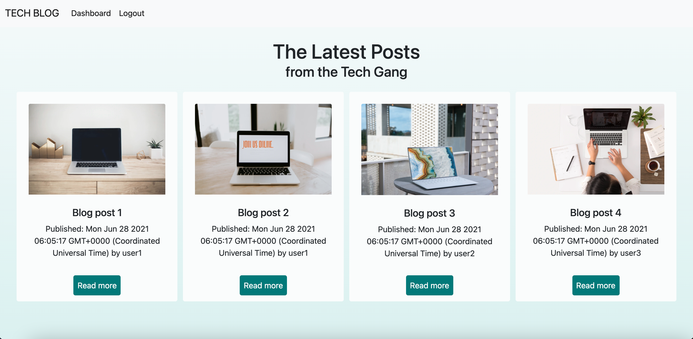
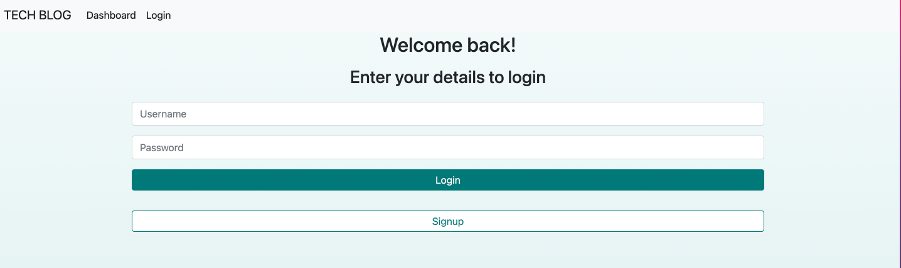
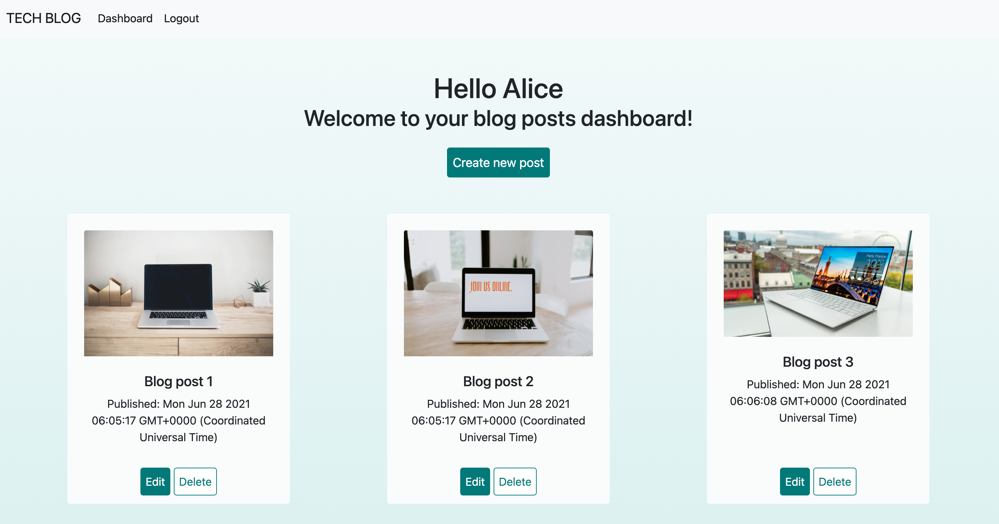
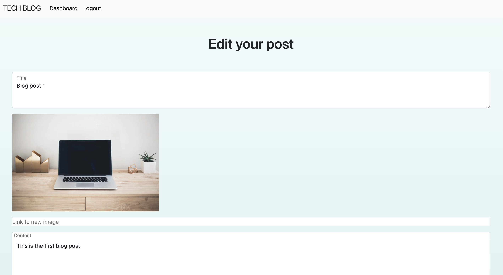

# Tech Blog

## Table of Contents
  - [Description](#description)
  - [Key features](#key-features)
  - [Technologies used](#technologies-used)
  - [Screenshots](#screenshots)
  - [Installation](#installation)

## Deployed Application
https://fathomless-plains-35453.herokuapp.com/

## Description
This application is a blogging platform which allows users to create, edit and delete blog posts as well as leave comments on them.

## Key Features
- uses a custom authentication middleware to ensure that only logged in users get access to private pages such as the dashboard
- hashes user passwords before saving them into the database to ensure security
- allows users to create, edit or delete their posts
- allows users to view other people's posts
- allows users to leave comments on blog posts and later edit or delete them
- uses a custom build data formating helper to ensure publishing dates appear in a user friendly format
- utilises the setTimeOut Javascript function to create smoothe user experiences and transitions between screens e.g if a user deletes a post they see a success message and the page is refreshed after a second
- uses try catch blogs and error handling to ensure that the user is always appropriately informed if something goes wrong

## Technologies Used
- Node.js
- Javascript
- jQuery
- HTML
- CSS5

Npm Packages
- handlebars
- mySql2
- Sequelize
- Express
- Express-sessions
- Bcrypt
- Moment

## Screenshots 
Home page

Login page

Dashboard page

Edit a post


## Installation 
- Clone the GitHub project onto your local machine
``` 
git clone https://github.com/dominikacookies/tech-blog
```
- Navigate into the project
- Open the project in VSCode
- Open the integrated terminal
- In the terminal, enter: 
  
  ```
  npm i  
  ``` 
  to install all of the packages.
  
  Next, use the schema file to create your database.
  
  To start the application enter
  
  ```
  npm run start  
  ``` 

 This will seed your database and start the application. 
 Ensure that you have installed node.
